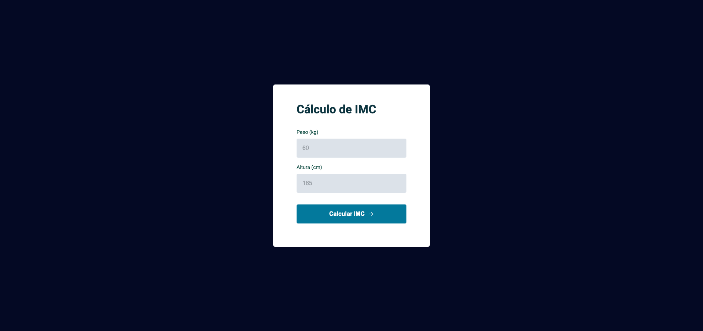

<h1 align="center"> BMI Calculator 🧮</h1>

 

## 💻 About this project

This project was provided by Rocketseat course that the goal is to build an BMI Calculator, on this project I have used some principles from ES6 modules, and validate some fields.

Demo link: https://thebmicalc.netlify.app/

## 🖥️ Screenshot

    

This project was developed following the instructions from Rocketseat - :rocket: [Rocketseat community on Discord](https://discord.gg/rocketseat)
